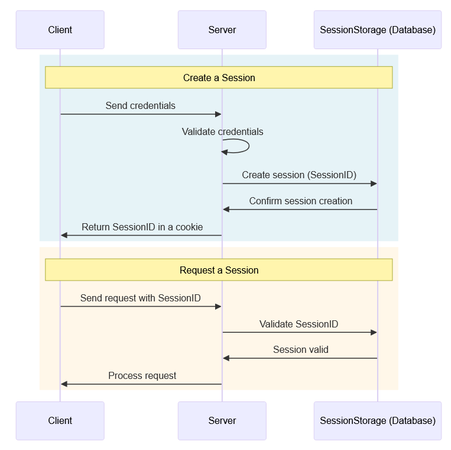
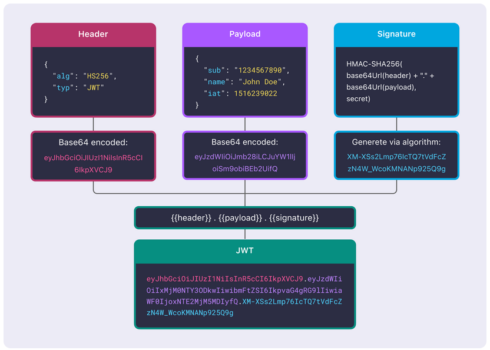
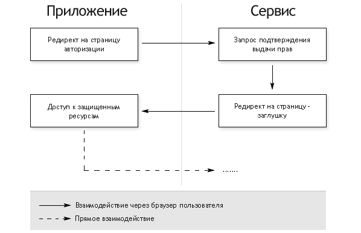

# angular-auth-tschool


## Введение
На этой лекции мы затронем важную тему для любого веб-разработчика - аутентификацию и авторизацию пользователей. 

В крупных компаниях, приходя на проект, разработчик попадает в уже готовую инфраструктуру, где об авторизации и аутентификации позаботились ранее и доработок в эти модули не требуется, но по статистике (британских ученых), каждый веб-разработчик хотя бы раз реализовывал вход пользователя в систему - будь то на рабочем или домашнем проекте (кто нам поможет дома, кроме нас?)

Сайты-визитки, лендинги могут обходиться без этого, но большинство веб-приложений работает с задачами конкретных пользователей и требует разделения на роли и подтверждение личности - блоги, банковские приложения, почта, развлекательные порталы и т.д. 
Ниже мы погрузимся в мир сессий, безопасности, инструментов браузера и, конечно, т.к у нас курс по Angular, реализации этих вещей на нашем любимом фреймворке.

## Аутентификация? Авторизация?
Во время учебы, один из моих преподавателей физики, объясняя какие-либо термины или явления, любил говорить "Вот схватят вас за рукав и спросят *что-то сложное физическое*...", так вот, если бы вас схватили за рукав и спросили "Чем отличается аутентификация от авторизации?", что бы вы ответили? Подумайте, и давайте сверимся:

**Аутентификация** - подтверждение личности пользователя (кто вы?)

**Авторизация** - проверка прав доступа пользователя (что вам можно?)


Или, если привести более полные определения из Википедии:

**Аутентифика́ция** (англ. authentication ← греч. αὐθεντικός [authentikos] «реальный, подлинный» ← αὐτός [autos] «сам; он самый») — процедура проверки подлинности, например:
- проверка подлинности пользователя путём сравнения введённого им пароля (для указанного логина) с паролем, сохранённым в базе данных пользовательских логинов;
- подтверждение подлинности электронного письма путём проверки цифровой подписи письма по открытому ключу отправителя;
- проверка контрольной суммы файла на соответствие сумме, заявленной автором этого файла.

**Авториза́ция** (англ. authorization «разрешение; уполномочивание») — предоставление определённому лицу или группе лиц прав на выполнение определённых действий; а также процесс проверки (подтверждения) данных прав при попытке выполнения этих действий. В том числе путем передачи таких прав другому лицу. 

Со стороны UI/UX для пользователя аутентификация и авторизация могут происходить одновременно  - при входе в интерфейс, но со стороны разработчика это два разных процесса, хотя, например, JWT токен может хранить и роли пользователя - об этом мы поговорим позже, но также доступы пользователя можно получать, например, через отдельный запрос на бэкенд, или же бэкенд сам может определять при каждом запросе уровень прав запрашивающего и, в случае несовпадения желаемых доступов, возвращать ошибку 403 или что-то другое, в зависимости от контракта бэка с фронтом.

На самом деле, в цепочке 

Аутентификация -> Авторизация 

Есть еще один этап - **Идентификация** - это распознавание пользователя по его уникальному идентификатору - телефону, логину, e-mail. Например, при регистрации на сайте вам может подсветиться, что "этот логин уже занят", тем самым, была пройдена идентификация и система распознала, что данный пользователь уже существует. В рамках реализации идентификация и аутентификация идут, как правило, вместе.

В свою очередь, про аутентификацию можно добавить еще то, что она может быть как однофакторной - стандартный ввод пароля, так и двухфакторной - дополнительное подтверждение через код на телефон/почту, код из аутентификатора. Если у вас украли пароль, двухфакторная аутентификация спасет вас (в большинстве случаев) от потери аккаунта - у злоумышленников нет доступа к вашему аутентификатору/телефону. Как говорится, *"Никому не сообщайте код. Его спрашивают ТОЛЬКО мошенники"*

Разберемся с аутентификацией подробнее и поговорим о способах аутентификации

## Как работает аутентификация в вебе 

Есть несколько основных способов обеспечить аутентификацию со стороны клиента:
- Сессия
- JWT токен
- OAuth 2.0

Двухфакторную аутентификацию иногда выделяют как еще один отдельный способ, но на этой лекции мы ее подробно рассматривать не будем

### Сессия
> Сервер хранит информацию о пользователе у себя

#### Порядок действий: 
1. Пользователь аутентифицируется (предоставляет учетные данные серверу). 
2. Если данные верны, сервер создаёт постоянную запись, представляющую эту **сессию**. Сессия содержит информацию, такую как случайная строка, идентификатор пользователя, время начала сессии, время истечения сессии и т.д в формате, например, JSON. Сервер сохраняет эту информацию у себя, а в ответ на запрос аутентификации в одном из заголовков ответа отправляет session_id, который будет помещен в Cookie. Ниже приведены примеры Set-Cookie:  
```
Set-Cookie: <cookie-name>=<cookie-value>
Set-Cookie: <cookie-name>=<cookie-value>; Domain=<domain-value>
Set-Cookie: <cookie-name>=<cookie-value>; Expires=<date>
Set-Cookie: <cookie-name>=<cookie-value>; HttpOnly
Set-Cookie: <cookie-name>=<cookie-value>; Max-Age=<number>
Set-Cookie: <cookie-name>=<cookie-value>; Partitioned
Set-Cookie: <cookie-name>=<cookie-value>; Path=<path-value>
Set-Cookie: <cookie-name>=<cookie-value>; Secure

Set-Cookie: <cookie-name>=<cookie-value>; SameSite=Strict
Set-Cookie: <cookie-name>=<cookie-value>; SameSite=Lax
Set-Cookie: <cookie-name>=<cookie-value>; SameSite=None; Secure

// Multiple attributes are also possible, for example:
Set-Cookie: <cookie-name>=<cookie-value>; Domain=<domain-value>; Secure; HttpOnly
```
Можно добавлять несколько аттрибутов в заголовок set-cookie, давайте рассмотрим некоторые из них:  
- `HttpOnly` - запрещает JavaScript получать значение cookie через API, например, Document.cookie. Этот заголовок помогает защититься от атак XSS (cross-site scripting)
- `Expires=<date>` - обозначает максимальное время жизни куки в формате HTTP-timestamp. Если не задан, кука становится **сессионной** (session cookie) и будет удалена в случае закрытия браузера. У многих браузеров есть фича восстановления браузерной сессии, при которой восстанавливаются вкладки и сессионные куки в том числе. 
- `Max-Age=<number>` - обозначает время  в секундах, пока кука не просрочится. Отрицательное значение или 0 просрочит куку незамедлительно. Если заданы аттрибуты Expires и Max-Age, Max-Age имеет приоритет для использования.  
Обычно значение 0 отправляют, чтобы разлогинить пользователя:
`Set-Cookie: session_id=abc123; Max-Age=0`

Об остальных аттрибутах подробнее можно узнать на [MDN (Set-Cookie)](https://developer.mozilla.org/en-US/docs/Web/HTTP/Reference/Headers/Set-Cookie)

3. При каждом последующем обращении клиента в заголовках запроса добавляется `Cookie: session_id=abc123 `, сервер по этому идентификатору находит сессию и определяет пользователя.

**Преимущества аутентификации на основе сессий:**
- Данные не хранятся на клиенте 
- Полный контроль на сервере
- Простой logout 
- Автоматическая работа через cookies - браузер сам сохраняет cookie и подставляет ее в каждый запрос

**Минусы:**
- Сервер должен хранить сам все сессии
- Сложнее масштабировать - если есть несколько серверов, нужно общее хранилище сессий или механизм по синхронизации актуальных сессий
- Проблемы с CORS - если фронтент и бэкенд на разных доменах, нужно разрешить на сервере отправлять куки с других доменов (`Access-Control-Allow-Credentials: true`) и с фронта использовать параметр withCredentials: true, в Ангуляре HttpClient позволяет его задавать при запросах.
- Уязвимость к CSRF (Cross-Site Request Forgery) - вкратце, это атака, при которой злоумышленник заставляет браузер жертвы автоматически выполнить нежелательный запрос на сайт, где жертва авторизована.

Ниже приведена схема аутентификации через сессию



Долгое время аутентификация через сессии была стандартом веб-разработки.
С появлением SPA и REST API стали популярны JWT-токены, которые позволяют хранить информацию на клиенте и делают аутентификацию stateless. Рассмотрим аутентификацию через токены ниже

### JWT (JSON Web Token)

> JWT - это компактный токен, который сервер выдаёт после аутентификации и который клиент хранит на своей стороне. Токен содержит зашифрованную или подписанную информацию о пользователе и может использоваться для stateless аутентификации.

#### Порядок действий:
1. Пользователь аутентифицируется (предоставляет логин/пароль серверу).
2. Если данные верны, сервер создаёт JWT, который обычно содержит:
    - идентификатор пользователя (userId)
    - роли/права (roles)
    - время жизни токена (exp)
    - дополнительные данные по необходимости

Пример токена (в Base64URL-формате):

`<header>.<payload>.<signature>`
Header - информация о типе токена и алгоритме подписи, например:
```
{
  "alg": "HS256",
  "typ": "JWT"
}
```

Payload - данные пользователя:
```
{
  "sub": "1234567890",
  "name": "John Doe",
  "roles": ["user"],
  "iat": 1679836800,
  "exp": 1679840400
}
```

Signature - криптографическая подпись, которая проверяет, что токен не изменили



Кодировать/декодировать JWT токены можно на сайте https://www.jwt.io/ - он безопасен и не сохраняет никаких данных. 

3. Сервер отправляет токен клиенту
    Чаще всего клиент сохраняет его в:
    - localStorage
    - sessionStorage
    - или в HttpOnly cookie (более безопасно)

4. При каждом следующем запросе клиент отправляет токен в заголовке
    `Authorization: Bearer <jwt-token>`
 
 **Преимущества JWT:**
- Stateless - сервер не хранит сессии, легко масштабировать
- Удобно для SPA и мобильных приложений - токен можно хранить на клиенте и использовать с любым API
- Можно хранить данные о пользователе прямо в токене (roles, permissions)
- Переносимость - один и тот же токен можно использовать между разными сервисами (SSO)
- Улучшенная безопасность - JWT используют методы подписи и шифрования, затрудняющие атаки

**Минусы:**
- Невозможность мгновенной инвалидации - пока токен не истёк, его нельзя просто “убрать” с клиента
- Риск кражи токена, если хранить его в localStorage
- Нужно контролировать срок жизни — короткие токены безопаснее, но неудобнее; часто используют refresh tokens
- Уязвимость к CSRF (Cross-Site Request Forgery) - вкратце, это атака, при которой злоумышленник заставляет браузер жертвы автоматически выполнить нежелательный запрос на сайт, где жертва авторизована
- Неправильная реализация может быть уязвима (использование небезопасного алгоритма шифрования)


Итак, постепенно мы смешали все-таки понятия авторизации и аутентификации, ведь JWT позволяет не только определить личность пользователя, но и передать его права и доступы. Значит, настало время перейти к рассмотрению еще одного протокола авторизации и аутентификации - OAuth 2.0

### OAuth 2.0

> Чаще всего, нажимая на кнопки вида "Войти с помощью..." Google, VK, T-ID или любой другой соцсети, вы авторизуетесь при помощи протокола Open Authorization 2.0

Важно заметить, что это протокол именно авторизации, но часто используется в связке с OpenID (OpenID Connect) - протоколе аутентификации, который подтверждает личность пользователя и передает эту информацию стороннему сервису. 

Разберёмся, что такое OAuth. Соцсеть - это **сервер ресурсов**, ваше приложение - **клиент**, а пытающийся войти в ваше приложение пользователь -  **владелец ресурса**. Ресурсом называется пользовательский профиль / информация для аутентификации. **Авторизационный сервер** -  система, которая проверяет личность владельца ресурса, выдаёт токены доступа и управляет разрешениями, предоставленными клиенту.  

Рассмотрим упрощенную схему получения доступа к данным.

1. **Направление на сервер авторизации.** Клиентское приложение перенаправляет владельца ресурса на сервер авторизации через URL с уникальными параметрами запроса:

   - client_id — идентификатор клиентского приложения;
   - redirect_uri — URI для перенаправления после авторизации;
   - scope — права доступа, которые запрашивает приложение.

По этим параметрам сервер распознаёт приложение и определяет, какие права оно запрашивает.

2. **Ввод учётных данных.** На сервере авторизации пользователь вводит логин и пароль или другие данные. После успешной проверки сервер запросит разрешение у владельца ресурса предоставить доступ клиенту.

3. **Получение кода авторизации.** После согласия сервер выдаёт код авторизации и перенаправляет пользователя обратно в приложение, передавая код через URL. Этот код имеет ограниченный срок действия и может быть использован только один раз.

4. **Обмен кода на токен доступа.** Клиентское приложение отправляет полученный код на сервер авторизации и обменивает его на токен доступа. Сервер проверяет код и выдаёт токен, который используется для запросов к серверу ресурсов.

5. **Доступ к данным.** Клиентское приложение использует токен для запроса данных у ресурсного сервера. В ответ сервер предоставляет доступ к запрашиваемым данным.

Для реализации такого механизма вам может понадобиться зарегистрировать своё приложение в разных соцсетях. Вам дадут app_id и другие ключи для конфигурирования подключения к соцсетям. Также есть готовые библиотеки, которые помогают с этим.



Для более подробного знакомства с темами, предлагаю список следующих статей (или любых, которые вам понравятся из гугла, ЛЛМки также могут хорошо проконсультировать по теме):
- https://blog.logto.io/ru/token-based-authentication-vs-session-based-authentication
- https://skillbox.ru/media/code/chto-takoe-oauth-20-ponyatie-i-printsip-raboty/
- https://habr.com/ru/companies/vk/articles/343288/
- https://habr.com/ru/articles/720842/
- https://developer.mozilla.org/en-US/docs/Web/HTTP/Reference/Headers

  
Далее рассмотрим примеры реализации всех трех способов аутентификации + авторизации, а заодно поговорим про Angular Interceptors, Angular Guards
